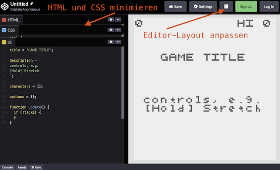

## Erstellung des Ein-Knopf-Mini-Spiels PIN CLIMB

[Originalquelle (Englisch)](https://abagames.github.io/literate-diff-viewer/pinclimb/)

Dieser Artikel erklärt, wie man ein Ein-Knopf-Mini-Spiel mit der
JavaScript-Bibliothek [crisp-game-lib](https://github.com/abagames/crisp-game-lib) erstellt.

Die Bezeichnung „Ein-Knopf“ bedeutet, dass das Spiel nur
durch eine einzige Interaktionsmöglichkeit wie z.B. das
„Drücken“ bzw. „Gedrückt halten“ eines Touch-Displays, Trackpads
oder Mausbuttons bedienbar ist.

Bei einem Ein-Knopf-Mini-Spiel ist es wesentlich, sich zu entscheiden, welche Funktionen dem einen Knopf zugewiesen werden sollen. Dazu gibt es weitere Informationen in folgendem Artikel:

- [How to realize various actions in a one-button game](https://dev.to/abagames/how-to-realize-various-actions-in-a-one-button-game-fak)

In dem Spiel, das wir gleich erstellen werden, werden wir die Funktion "stretch" (dehnen) dem einen Knopf zuweisen. Dies sind die Regeln des Spiels:

- Du kontrollierst ein sich drehendes „Seil“, das als gerade Linie dargestellt wird.
- Das Seil dehnt sich und wird immer länger, solange der Knopf gedrückt gehalten wird, und es schrumpft, wenn der Knopf losgelassen wird.
- Das Seil dreht sich um eine Position, die mit einer „Nadel“ markiert ist.
- Neue Nadeln erscheinen forlaufend von oben auf dem Bildschirm und scrollen nach unten.
- Wenn das Seil auf eine andere Nadel stößt, bewegt sich das Seil zu dieser Nadel und dreht sich von nun um diese.
- Wenn das Seil den unteren Bildschirmrand erreicht, ist das Spiel vorbei.

### Template des Codes in Codepen

Wir verwenden [dieses Template in Codepen](https://codepen.io/pen?template=bGZrvzg), sodass du direkt im Browser programmieren und dort die hier besprochenen Änderungen am Code eintragen kannst. Klicke dazu [hier](https://codepen.io/pen?template=bGZrvzg).

Es empfiehlt sich, den Editor in Codepen so anzupassen, dass der Code links zu sehen ist. Auf der rechten Seite wird dann das Spiel angezeigt. Alle Änderungen im Code werden hier ausschließlich in JavaScript programmiert, sodass du die HTML- und CSS-Bereiche minimieren kannst. Siehe dazu diesen Screenschot:



### Mini-Tutorial

Lass mich erklären, wie du mit diesem Mini-Tutorial arbeitest. Wird der Quellcode auf der rechten Seite des Bildschirms angezeigt? Wenn nicht, scrolle die Seite nach unten, bis dieser Textabschnitt ungefähr in der Mitte des Bildschirms ist.

(src) [0_template.js](./src/0_template.js)

Der neu hinzugefügte Quellcode wird auf der rechten Seite des Bildschirms angezeigt. D
ie Anzeige ist in einem [vereinheitlichen Format von diff](https://en.wikipedia.org/wiki/Diff#Unified_format), wodurch Unterschiede zwischen Änderungen an Textdateien gegenübergestellt werden. Zeilen die ein `+` am Anfang haben, sind hinzugefügte Zeilen, und
Zeilen mit `-` sind gelöschte Zeilen. Dadurch kannst du die einzelnen Schritte nachvollziehen, die wir im Laufe dieses Tutorials durchführen werden.

Wenn du das oben erwähnte Template in Codepen nutzt, dann ist bereits alles vorbereitet. Alternativ kannst du auch mit einer anderen Umgebung wie z.B. VS Code arbeiten. Um darin ein Spiel mit `crisp-game-lib` zu erstellen, musst du den Vorlagen-Quellcode vorbereiten. Für mehr Informationen siehe [Getting started](https://github.com/abagames/crisp-game-lib#getting-started) im README von `crisp-game-lib`.

### Starten des Tutorials

Schau dir die Vorlage rechts oben auf dem Bildschirms an. `title` ,`description`, `characters` und `options` sind (globale) Variablen.
Mit `title` wird der Titel des Spiels bestimmt und `description` ist ein möglicherweise mehrzeiliger Template-String für die Beschreibung des Spiels, die z.B. die Bedienung erklärt. `characters` definieren die auf dem Bildschirm angezeigte Pixelkunst (z.B. Spielfiguren) als Array und `options` ist ein JavaScript-Object, um die Spieleinstellungen festzulegen. Diese Variablen werden wir später festlegen, wobei wir `characters` nicht benötigen werden. Zu allen hier erwähnten Funktionen gibt es mehr Informationen in der `crisp-game-lib`-Referenz (siehe z.B. [Options](https://abagames.github.io/crisp-game-lib/ref_document/types/Options.html) für die `options`-Variable).

Die `update` Funktion beschreibt die Logik des Spiels und muss von uns definiert werden. Die `update` Funktion wird von `crisp-game-lib` automatisch 60-mal pro Sekunde aufgerufen, um den Spielbildschirm zu zeichnen, auf Mausoperationen zu reagieren, usw.

Die zur Laufzeit von `crisp-game-lib` bereitgestellte Variable `ticks` in der `update` Funktion ist `0`, wenn das Spiel startet. `ticks` wird automatisch in jedem Funktionsaufruf von `update` (alle 1/60 Sekunden) um eins erhöht. Die Anweisung `if (!ticks) {}`ist gleichbedeutend mit`if (ticks === 0) {}`. Die einmal ausgeführte Initialisierung zu Spielbeginn kann somit im `if`-Rumpf `{}` durchgeführt werden.

### Nadeln anzeigen

(src) [1_pins_variable.js](./src/1_pins_variable.js)

Deklariere eine Variable `pins` außerhalb der `update`-Funktion.
Beim ersten Aufruf von `update` wird `pins` im Rumpf der `if`-Bedingung ein Array mit einem Vektor-Element zugewiesen:

```
pins = [vec(50, 5)];
```

`pins` („Nadeln“ im Deutschen) ist ein Array, das später die Koordinaten aller auf dem Bildschirm sichtbaren Nadeln enthalten wird.

Die `vec()` Funktion erstellt eine [Vector](https://abagames.github.io/crisp-game-lib/ref_document/classes/Vector.html) Instanz mit der x-Koordinate (hier `50`) als erstem Argument und der y-Koordinate als zweitem (hier `5`). Neben `vec` werden wir einige weitere Funktionen von `crisp-game-lib` verwenden.

Die Array-Funktion `forEach` von JavaScript wird verwendet, um mit den Koordinaten jedes Vektors in `pins` eine [Box](https://abagames.github.io/crisp-game-lib/ref_document/functions/box.html) zu zeichnen. Zu Beginn des Spiels ist dies erste eine Box und bei späteren Aufrufen von `update` werden weitere hinzukommen.

Die `box` Funktion nimmt Koordinaten als erstes Argument (hier ein Vektor `p`) und seine Größe als zweites Argument (`3`). Der `crisp-game-lib`-Bildschirm besteht aus 100x100 Punkten, mit (0,0) oben links und (99,99) unten rechts, sodass das Kästchen (`Box`) horizontal in der Mitte (`50`) und vertikal an der oberen Kante (`5`) erscheint.

Ein Box wird in diesem Spiel als „Nadel“ (`pin`) aufgefasst, an der das „Seil“ befestigt werden kann.

**Hinweis:** Um die Auswirkungen der Änderungen am Code im Spiel zu sehen, muss du das Spiel durch ein Antippen oder Mausklick auf die Spielfläche starten. Wenn du das Spiel beendest, kannst du es durch erneutes Antippen oder Mausklick auf die Spielfläche neu starten.

### Nadeln hinzufügen und nach unten scrollen

(src) [2_add_pins.js](./src/2_add_pins.js)

Lasse Nadeln (d.h. `Box`-Elemente) von der oberen Kante des Bildschirms in einem bestimmten Intervall erscheinen und nach unten scrollen. Deklariere dazu die Variable `nextPinDist` direkt in der Zeile unter der Deklaration von `pins` und initialisiere sie im `if`-Block mit der Distanz zur nächsten Nadel, damit es zwischen deren Erscheinen einen zeitlich Abstand gibt (dies geschieht beim ersten Durchlauf von `update` in der Initialisierung mit dem Wert `5`).

Lege die Distanz in y-Richtung, die automatisch bei jedem Durchlauf bzw. Aufruf von `update` gescrollt werden soll, in der `scroll` Variable (`0.02`) fest. Füge den Wert von `scroll` zur y-Koordinate jeder Nadel hinzu (dies geschieht im `forEach`-Aufruf beim Durchlauf der Elemente in `pins`). Zu Beginn haben wir nur eine Nadel. Gleich sorgen wir dafür, dass weitere Nadeln mit etwas Abstand erscheinen.

Zunächst wird in jedem Durchlauf bzw. Aufruf von `update` der Wert von `nextPinDist` mit dem zuvor festgelegten `scroll`-Betrag verringert:

```
nextPinDist -= scroll;
```

Sobald in einem Durchlauf `nextPinDist` kleiner als 0 ist, füge eine neue Nadel mit der `push` Funktion dem `pins`-Array hinzu:

```
pins.push(vec(rnd(10, 90), 0));
```

Die x-Koordinate der neuen Nadel wird zufällig zwischen 10 und 90 gesetzt, d.h. mit etwas Abstand zum seitlichen Rand der Spielfläche von 100x100. Dies geschieht mit der Funktion [rnd](https://abagames.github.io/crisp-game-lib/ref_document/functions/rnd.html) im Ausdruck `vec(rnd(10, 90))`. Die `rnd`-Funktion gibt einen Wert zwischen dem ersten und dem zweiten Argument zurück. Die y-Koordinate der neuen Nadel erhält den Wert `0` für den oberen Bildschirmrand. Die nächste Zeile randomisiert zusätzlich den Abstand zur nächsten Nadel:

```
nextPinDist += rnd(5, 15);
```

Die Distanz zur nächsten Nadel wird somit ebenfalls mit der `rnd` Funktion berechnet und zum aktuellen Wert von `nextPinDist` addiert.

### Eine Nadel löschen, die außerhalb des Bildschirms ist

(src) [3_remove_pins.js](./src/3_remove_pins.js)

Wenn du eine Nadel, die außerhalb des Bildschirms gescrollt ist, nicht entfernst, bleibt sie für immer im `pins`-Array. Verwende anstelle von `forEach` die `crisp-game-lib`-Funktion [remove](https://abagames.github.io/crisp-game-lib/ref_document/functions/remove.html), um die Nadeln außerhalb des Bildschirms zu entfernen.

Die `remove` Funktion nimmt als erstes Argument ein Array und als zweites Argument eine Funktion. Die Funktion wird automatisch für jedes Element des Arrays aufgerufen und erhält dabei das aktuelle Element als Argument. Wenn die Funktion `true` zurückgibt, wird dieses Element aus dem Array entfernt. Die Nadel wird entfernt, indem `true` von der Funktion zurückgegeben wird, wenn diese außerhalb des Bildschirms ist („y-Koordinate der Nadel > 102“):

```
return p.y > 102;
```

### Ein Seil hinzufügen

(src) [4_add_cord.js](./src/4_add_cord.js)

Die `cord` Variable verwaltet das Seil. Wie `pin` und `nextPinDist` wird `cord` außerhalb von `update` deklariert, damit der aktuelle Wert in nachfolgenden Aufrufen von `update` erhalten bleibt. Definiere dort ebenso eine Konstante für die Länge des Seils namens `cordLength` mit Wert `7`.

Das `cord`-Objekt wird in `if (!ticks) {}` initialisiert und hat Eigenschaften für den Winkel (`angle`), die Länge (`length`) und die Nadel (`pin`) zur Befestigung des Seils.

Das Seil wird durch die Änderungen im nächsten Schritt sichtbar.

### Ein Seil zeichnen

(src) [5_draw_cord.js](./src/5_draw_cord.js)

Der Winkel des Seils wird in jedem `update`-Aufruf um den Wert `0.05` erhöht, damit sich das Seil im Uhrzeigersinn dreht:

```
cord.angle += 0.05;
```

Zeichne das Seil danach mit der `line`-Funktion:

```
line(cord.pin, vec(cord.pin).addWithAngle(cord.angle, cord.length));
```

Die Funktion [line](https://abagames.github.io/crisp-game-lib/ref_document/functions/line.html) zeichnet eine Linie, die die Koordinaten des ersten und zweiten Arguments verbindet. Der Startpunkt des Seils ist die Position der Nadel (`cord.pin`) und der Endpunkt wird wie folgt festgelegt:

```
vec(cord.pin).addWithAngle(cord.angle, cord.length)
```

Die Funktion `addWithAngle` von `Vector` verschiebt die Koordinaten in Richtung des Winkels des ersten Arguments um die Entfernung des zweiten Arguments. Hierdurch erhält das Seil seine geradlinige Ausdehnung.

### Das Seil dehnt sich, wenn ein Knopf gedrückt wird

(src) [6_extend_cord.js](./src/6_extend_cord.js)

`crisp-game-lib` stellt eine Variable [input](https://abagames.github.io/crisp-game-lib/ref_document/modules/input.html) zur Verfügung, die zur Laufzeit (d.h. in jedem Aufruf von `update`) den Eingabezustand von Maus, Touchscreen oder Tastatur enthält. Die `input.isPressed` Variable ist `true`, wenn ein Mausbutton, Touchscreen oder eine Taste gedrückt wird.

Nun wird die Länge des Seils um 1 erhöht, wenn der Knopf gedrückt gehalten wird, und kehrt schrittweise zum anfänglichen `cordLength` Wert zurück, wenn der Knopf losgelassen wird:

```
if (input.isPressed) {
  cord.length += 1;
} else {
  // Knopf losgelassen:
  // Seillänge in jedem Durchlauf etwas verkürzen
  cord.length += (cordLength - cord.length) * 0.1;
}
```

### Scrollen gemäß der Position des Seils

(src) [7_scroll_cord.js](./src/7_scroll_cord.js)

Nadeln scrollen von oben auf dem Bildschirm nach unten, daher ist es schwierig zu sehen, was jenseits des Bildschirms passiert, wenn das Seil oben ist. Sollte das Seil in der Nähe der oberen Kante des Bildschirms sein, wird die Scrollgeschwindigkeit erhöht, um das Seil schneller nach unten zu bewegen &mdash; bis es sich in der unteren Hälfte des Bildschirms befindet:

```js
if (cord.pin.y < 80) {
  scroll += (80 - cord.pin.y) * 0.1;
}
```

**Tipp:** Verändere den Wert von `0.1` und beobachte, wie sich dies auf die Scrollgeschwindigkeit auswirkt. Somit lässt sich der Code besser nachvollziehen.

Wir fügen auch einen Vorgang hinzu, um das Spiel zu beenden, wenn das Seil den unteren Bildschirmrand erreicht. Durch Aufrufen der [end](https://abagames.github.io/crisp-game-lib/ref_document/functions/end.html) Funktion wird das Spiel in den Game-Over-Zustand übergehen.

### Das Seil bewegt sich zu einer anderen Nadel

(src) [8_move_to_pin.js](./src/8_move_to_pin.js)

Ergänze den Code so, dass das Seil zu einer anderen Nadel wechselt, wenn es mit dieser kollidiert. Dazu benötigen wir zunächst eine neue Variable `nextPin`
innerhalb von `update`.

Um eine [Collision](https://abagames.github.io/crisp-game-lib/ref_document/types/Collision.html) zu detektieren, verwende den Rückgabewert der `box` Funktion. Indem überprüft wird, ob `isColliding.rect.black` den Wert `true` hat, kann getestet werden, ob das Kästchen mit einem schwarzen Rechteck kollidiert. Die `line` Funktion, die zum Zeichnen eines Seils verwendet wird, zeichnet eine Linie, die aus mehreren Rechtecken besteht. Daher kann durch diesen Test festgestellt werden, ob die gezeichneten Nadeln mit dem Seil kollidieren.

Ersetze also `box(p, 3)` mit diesem Kollisions-Test:

```js
if (box(p, 3).isColliding.rect.black && p !== cord.pin) {
  nextPin = p;
}
```

Die Nadel, die mit dem Seil kollidiert, wird in der `nextPin` Variablen gespeichert. Wenn `nextPin` nicht `null` ist, bewege das Seil zu `nextPin` und setze die Seillänge auf den anfänglichen Wert `cordLength` zurück.

### Punkte hinzufügen

(src) [9_add_score.js](./src/9_add_score.js)

Dieses Spiel soll nun mit Punkten erweitert werden. Hier addieren wir Punkte, nämlich die Bewegungsdistanz, wenn sich das Seil zu einer anderen Nadel bewegt. Die Bewegungsdistanz wird mit der `distanceTo` Funktion der `Vector` Klasse berechnet.

Das erste Argument der [addScore](https://abagames.github.io/crisp-game-lib/ref_document/functions/addScore.html) Funktion ist die hinzuzufügende Punktzahl. Wenn das zweite Argument eine Koordinate ist, wird die hinzugefügte Punktzahl an dieser Koordinate angezeigt. Das zweite Argument ist optional und die Punktzahl wird nicht angezeigt, wenn sie weggelassen wird.

Außerdem wird ein Soundeffekt entsprechend zum Punkteaddieren abgespielt. Verwende die [play](https://abagames.github.io/crisp-game-lib/ref_document/functions/play.html) Funktion, um den Sound abzuspielen. Das erste Argument der `play` Funktion legt die Art des Soundeffektes fest. Es gibt mehrere Arten von Soundeffekten, wie `coin`, `select`, `hit`, `explosion`, `laser`, `jump` und so weiter, zusätzlich zum hier angegebenen `powerUp`.

### Weitere Soundeffekte hinzufügen

(src) [10_play_ses.js](./src/10_play_ses.js)

Zusätzlich zu den Bewegungen des Seils kannst du auch andere Soundeffekte abspielen. Der `select` Sound wird im Moment des Knopfdrucks abgespielt. Du kannst feststellen, wann ein Knopf gedrückt wird, indem du überprüfst, ob `input.isJustPressed` `true` ist. Es wird nun auch ein `explosion` Sound abgespielt, wenn das Spiel vorbei ist.

Die letzten beiden Änderungen waren nur kleine Anpassungen im Code, aber sie machen das Spiel viel interessanter. Wenn du das Spiel jetzt spielst, kannst du die Soundeffekte hören.

Inzwischen haben wir die grundlegende Logik des Spiels fertiggestellt. Für ein besseres Verständnis könnte es sinnvoll sein, den Aufbau des Codes in Ruhe nachzuvollziehen.

Als nächstes werden wir das Spiel schrittweise schwieriger machen.

### Das Spiel schrittweise schwieriger machen

(src) [11_adjust_difficulty.js](./src/11_adjust_difficulty.js)

In Mini-Spielen ist es wichtig, das Spiel im Laufe der Zeit schrittweise schwieriger zu machen und dadurch Spannung für die Spieler zu erzeugen. Eine bewährte Methode, Spiele schwieriger zu machen, ist es, die Spielgeschwindigkeit zu erhöhen.

Die `difficulty` Variable kann zur Anpassung der Schwierigkeit des Spiels verwendet werden. Die `difficulty` Variable ist zu Beginn des Spiels eins, nach einer Minute zwei und erhöht sich jede weitere Minute um eins. Dies geschieht automatisch in `crisp-game-lib`. Im Code wird `difficulty` nun eingesetzt, um verschiedene Aktionen zu beschleunigen.

Die Scrollgeschwindigkeit, die Dehnungsgeschwindigkeit des Seils und die Drehgeschwindigkeit des Seils erhöhen sich allmählich somit.

Somit ist der Quellcode für die Logik des Spiels bereits vollständig.

### Titel, Beschreibung und Optionen einstellen

(src) [12_set_options.js](./src/12_set_options.js)

Wenn du einen Titel (`title`) und eine Beschreibung (`description`) für dein Spiel festlegst, werden diese Texte auf dem Titelbildschirm vor dem Spielstart angezeigt. Du kannst auch Optionen mit `options` setzen. Hier kannst du das Abspielen von Hintergrundmusik (`isPlayingBgm`) aktivieren.

### Den Sound anpassen

(src) [13_change_sound.js](./src/13_change_sound.js)

Wenn `isPlayingBgm` aktiviert ist, wird während des Spiels automatisch Hintergrundmusik generiert und abgespielt. Auch die Soundeffekte, die von der `play` Funktion abgespielt werden, werden automatisch erzeugt. Diese Sounds können geändert werden, indem `seed` in den `options` eingestellt wird. Du kannst unterschiedliche Werte für `seed` setzen, bis du die Hintergrundmusik und Soundeffekte findest, die dir gefallen.

### Fertig!

(src) [99_completed.js](./src/99_completed.js)

Jetzt sind wir fertig. Es gibt [noch viele weitere Spiele](http://www.asahi-net.or.jp/~cs8k-cyu/browser.html), die `crisp-game-lib` verwenden. Einige Quellcodes sind als [Beispielcodes](https://github.com/abagames/crisp-game-lib-11-games/tree/main/docs) verfügbar.

Der finale Quellcode ist wie folgt:

```js
title = 'PIN CLIMB';

description = `
[Hold] Stretch
`;

characters = [];

options = {
  isPlayingBgm: true,
  seed: 8,
};

let cord;
let pins;
let nextPinDist;
const cordLength = 7;

function update() {
  if (!ticks) {
    pins = [vec(50, 5)];
    nextPinDist = 5;
    cord = { angle: 0, length: cordLength, pin: pins[0] };
  }
  let scroll = difficulty * 0.02;
  if (cord.pin.y < 80) {
    scroll += (80 - cord.pin.y) * 0.1;
  }
  if (input.isJustPressed) {
    play('select');
  }
  if (input.isPressed) {
    cord.length += difficulty;
  } else {
    cord.length += (cordLength - cord.length) * 0.1;
  }
  cord.angle += difficulty * 0.05;
  line(cord.pin, vec(cord.pin).addWithAngle(cord.angle, cord.length));
  if (cord.pin.y > 98) {
    play('explosion');
    end();
  }
  let nextPin;
  remove(pins, (p) => {
    p.y += scroll;
    if (box(p, 3).isColliding.rect.black && p !== cord.pin) {
      nextPin = p;
    }
    return p.y > 102;
  });
  if (nextPin != null) {
    play('powerUp');
    addScore(ceil(cord.pin.distanceTo(nextPin)), nextPin);
    cord.pin = nextPin;
    cord.length = cordLength;
  }
  nextPinDist -= scroll;
  while (nextPinDist < 0) {
    pins.push(vec(rnd(10, 90), 0));
    nextPinDist += rnd(5, 15);
  }
}
```
